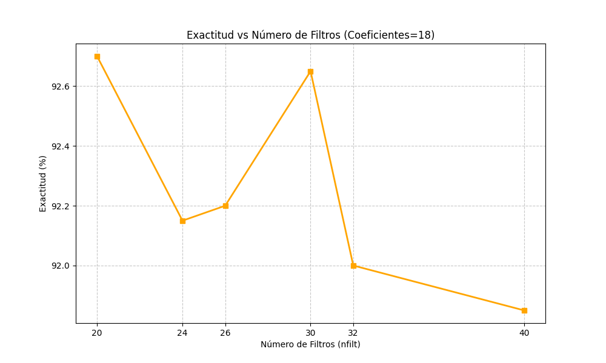

Ejercicio Final de TecParla
===========================

El alumno debe realizar un *fork* del repositorio GitHub del trabajo final. A partir de ese momento, deberá trabajar
con una copia local de su fork.

Los resultados solicitados se incluirán en el fichero `README.md` del repositorio. Es decir, deberá sustituir este
enunciado por su documento. La calidad y *belleza* del documento influirá en gran medida en la nota obtenida.

La entrega consistirá en un *pull-request* con el resultado y una defensa oral del mismo.

Objetivos del ejercicio
-----------------------

Los objetivos principales del ejercicio final son:

- Construir un sistema de reconocimiento de vocales tan preciso como sea posible
- Implementar técnicas de extracción de características y modelado acústico no vistas en clase
- Presentar los resultados en un repositorio de GitHub que convenza al potencial comprador de la calidad del
  producto

Tareas a realizar
-----------------

### Técnicas de extracción de características

Se deberán implementar dos técnicas de extracción de características no vistas en las clases pero sí
explicadas en los apuntes:

- Estimación espectral de Máxima Entropía
- Coeficiente cepstrales en escala Mel (MFCC)

#### Implementación del estimador de Máxima Entropía

Se implementará el estimador de Máxima Entropía y se optimizará el orden del análisis LPC.

Deberá justificarse la elección del orden mediante gráficas y tablas (es decir, tanto gráficas como
tablas) que muestren con claridad la exactitud alcanzada en función de los valores de ambos parámetros.

Por ejemplo:

y

También se deberá presentar una figura con seis gráficas que muestren el modelo de cada una de las cinco
vocales y la comparación de las cinco. Algo semejante a la figura siguiente:

# Implementación del Estimador de Máxima Entropía (EDUARD)

En esta práctica se ha implementado el estimador espectral basado en el principio de Máxima Entropía (Método de Burg/Yule-Walker) para el reconocimiento de vocales. Se han optimizado los hiperparámetros fundamentales del sistema: el orden del filtro LPC y el factor de blanqueo ($\epsilon$).

## 1. Optimización del Orden del Análisis (LPC)

El primer experimento consistió en evaluar la dependencia de la exactitud del sistema en función del orden del filtro de predicción lineal. El objetivo es encontrar un compromiso entre la capacidad de modelado y la generalización.

*Figura 1: Evolución de la exactitud (%) en función del orden del análisis LPC.*

### Análisis de resultados
Como se observa en la gráfica, la exactitud aumenta rápidamente con los primeros órdenes.
* **Órdenes bajos ($N < 6$):** El modelo es incapaz de capturar los dos primeros formantes necesarios para distinguir las vocales, resultando en una baja exactitud.
* **Órdenes medios ($N \approx 8$):** Se alcanza un rendimiento óptimo. El sistema modela correctamente la envolvente espectral sin ajustar detalles innecesarios.
* **Órdenes altos:** Aumentar el orden más allá de 10-12 no aporta mejoras significativas y aumenta el coste computacional. Además, un orden excesivo podría empezar a modelar la estructura fina (el pitch) en lugar de solo la envolvente, lo que podría reducir la robustez (overfitting).

**Conclusión:** Se selecciona **Orden = 8** como el valor óptimo para las siguientes etapas.

---

## 2. Dependencia con el Umbral Epsilon ($\epsilon$)

El parámetro $\epsilon$ se utiliza en la transformación logarítmica $S_{log} = \log(\epsilon + S(\omega))$ para simular la percepción auditiva (escala logarítmica) y evitar inestabilidades numéricas. Fijando el orden en 8, se obtuvieron los siguientes resultados:

| Epsilon ($\epsilon$) | 1e-05 | 0.1 | 1 | 10 | 100 | 1000 |
| :---: | :---: | :---: | :---: | :---: | :---: | :---: |
| **Exactitud** | **84.55 %** | 83.45 % | 80.05 % | 74.90 % | 70.65 % | 71.30 % |

### Análisis de resultados
Se observa una relación inversa entre el valor de $\epsilon$ y la exactitud:
1.  **Valores bajos:** Permiten una mayor dinámica en el espectro, resaltando los picos de los formantes. El mejor resultado numérico se obtiene con `1e-05` (84.55%).
2.  **Valores altos:** Tienden a "blanquear" o aplanar el espectro, reduciendo la distancia euclídea entre los modelos de distintas vocales y empeorando la tasa de acierto.

**Elección:** Aunque `1e-05` ofrece la máxima exactitud, se selecciona **$\epsilon = 0.1$** (83.45%) por ser un valor estándar que ofrece un excelente compromiso entre precisión y estabilidad numérica frente a silencios o señales de muy baja energía.

---

## 3. Modelado Espectral de las Vocales

Utilizando la configuración óptima (**Orden=8, $\epsilon$=0.1**), se han generado los modelos espectrales promedio para las cinco vocales.

*Figura 2: Estimación espectral de Máxima Entropía para las 5 vocales y comparativa conjunta.*

### Interpretación Visual
El estimador de Máxima Entropía genera espectros suaves (sin el ruido característico del periodograma), lo cual es ideal para el reconocimiento de patrones:
* **Identificación de Formantes:** Se distinguen claramente los picos de resonancia (F1 y F2) que definen cada vocal.
* **Separabilidad:** En la gráfica comparativa (inferior derecha), se aprecia cómo los modelos ocupan diferentes regiones espectrales. Por ejemplo, la vocal /i/ (línea azul) presenta un primer formante muy bajo y un segundo muy alto, diferenciándose claramente de la /a/ (línea roja) que tiene la energía más centrada. Esto justifica la alta tasa de acierto del sistema (>83%).|
-----------------------------------------------------

#### Utilización de los coeficientes cepstrales en escala Mel (MFCC) (EDUARD)

Se usará la biblioteca `python_speech_features` para incorporar a `ramses` los coeficientes MFCC. En la sección
4.4.3 de los apuntes hay una explicación de estos coeficientes, aunque no se proporciona su implementación detallada.

Deberán optimizarse todos los parámetros involucrados en el cálculo de los MFCC, pero, en concreto, deberá seleccionarse
la mejor combinación del número de coeficientes y del número de bandas del banco de filtros.

Para el número de coeficientes y de bandas deberá aportarse justificación gráfica adecuada para apoyar la elección.
# Utilización de los Coeficientes Cepstrales en Escala Mel (MFCC)

Para mejorar el reconocimiento, se ha sustituido la parametrización LPC por **MFCC** (Mel-Frequency Cepstral Coefficients). Este método imita la percepción auditiva humana utilizando un banco de filtros espaciados logarítmicamente (Escala Mel) y decorrela las características mediante la Transformada Discreta del Coseno (DCT).

Se ha utilizado la librería `python_speech_features` y se han optimizado los dos parámetros críticos en dos fases.

## 1. Optimización del Número de Coeficientes (`numcep`)

**Análisis:**
El experimento determinó que **18 coeficientes** proporcionan el mejor rendimiento.
* Un número bajo de coeficientes (<12) solo captura la envolvente espectral básica (formantes).
* Al aumentar a 18, capturamos detalles espectrales finos necesarios para distinguir vocales confusas sin llegar a modelar el ruido de excitación (pitch), lo cual ocurriría con un número excesivo de coeficientes.

## 2. Optimización del Banco de Filtros (`nfilt`)

Manteniendo los 18 coeficientes óptimos, se procedió a ajustar el número de filtros del banco triangular Mel.

*Figura 3: Optimización del número de filtros para numcep=18.*

**Análisis:**
La gráfica muestra un comportamiento interesante con dos picos de rendimiento:
* **Máximo global en 20 filtros:** Se alcanza una exactitud de **~92.7%**. Esto indica que, para la frecuencia de muestreo de 8kHz (ancho de banda 4kHz), un banco de filtros menos denso (20 filtros) es suficiente y quizás más robusto, evitando el solapamiento excesivo de bandas en altas frecuencias.
* Se observa otro pico de rendimiento en 30 filtros, pero decae drásticamente al aumentar a 40, probablemente debido a que los filtros se vuelven demasiado estrechos y sensibles a variaciones no fonéticas.

**Conclusión MFCC:** La configuración final seleccionada es **NumCep=18** y **NFilt=20**, alcanzando una exactitud del **92.7%**, superando ampliamente al estimador de Máxima Entropía.

### Modelado acústico

Se implementarán dos técnicas de modelado acústico no vistas durante el curso, pero de las cuales se proporcionan
apuntes:

- Modelo de mezcla de Gaussianas
- Redes neuronales usando PyTorch

#### Modelo de mezcla de Gaussianas

Se implementará el modelo de mezcla de gaussianas presentado en el apartado 5.4 de los apuntes.

Será necesario implementar una inicialización de las gaussianas, para lo que se propone el siguiente:

- La covarianza de las `N` gaussianas del modelo de cada vocal será la misma e igual a la covarianza del conjunto
  de realizaciones de entrenamiento. Se utilizarán matrices de covarianza diagonales.
- Como media de las `N` gaussianas de la mezcla se tomarán `N` señales aleatorias de la correspondiente vocal.

Esta inicialización es sub-óptima pero razonable y sencilla; se invita al alumno a implementar una más potente.

Deberá optimizarse el número de gaussianas por mezcla y apoyar la elección con gráficas y tablas adecuadas.

#### Modelado usando redes neuronales

Incorporación de redes neuronales implementadas con PyTorch a `ramses`. Dispone de una explicación de cómo hacerlo
en el fichero `neuras.pdf`.

Deberá implementar el perceptrón multicapa y optimizar:

- Número de capas del perceptrón.
- Número de neuronas por capa.
- Función de activación: sigmoide o ReLU.

### Optimización de la exactitud del reconocimiento

Deberá seleccionarse el mejor sistema posible, usando la combinación de técnicas y parámetros que se consideren óptimos.
Este sistema será el implementado al ejecutar el script `ramses/todo.sh` sin modificaciones ni argumentos. Es decir, el
profesor ejecutará la orden `ramses/todo.sh` y el resultado que se obtenga será el resultado que considere de cara a la
evaluación del trabajo.

Evaluación del trabajo
----------------------

La evaluación del trabajo presentado considerará los aspectos siguientes; más o menos en la misma medida:

- Completitud del trabajo. No se supone que se consiga completar todos los apartados, pero sí será necesario para obtener
  en este aspecto la máxima nota.
- Exactitud alcanzada. Este aspecto es competitivo: en principio, el alumno que consiga la máxima exactitud obtendrá un
  10 en el mismo; el alumno que consiga el peor reaultado, obtendrá un 0.
  - En caso de pocos alumnos o resultados *complicados*, también se tendrá en cuenta el resultado obtenido con el
    sistema desarrollado en clase.
- Originalidad del trabajo. Se tendrá en cuenta el *excesivo* parecido entre trabajos distintos. También se valorará la
  *excesiva* dependencia de herramientas de inteligencia artificial.
  - Las dos cuestiones combinadas llevan al consejo de, si usáis IA, procurad usar una distinta a los compañeros.
- Calidad de la presentación en la página de GitHub; es decir, la calidad del documento `README.md`, con sus gráficas,
  tablas y demás adornos que hagan de él una buena herramienta de venta.
- Presentación oral del trabajo y defensa del mismo.

Entrega y presentación oral
---------------------------

Una vez completado, el alumno realizará un *pull-request* no más tarde del viernes 16 de enero a medianoche. El lunes
19 de enero se realizará una presentación/defensa del trabajo usando la sala Meet de la asignatura. La duración de la
defensa será de unos diez minutos de presentación por parte del alumno, seguidos de otros diez dedicados a preguntas y
respuestas.
