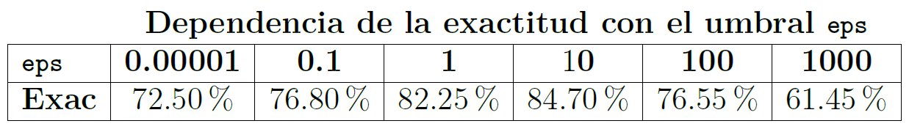

Ejercicio Final de TecParla
===========================

El alumno debe realizar un *fork* del repositorio GitHub del trabajo final. A partir de ese momento, deberá trabajar
con una copia local de su fork.

Los resultados solicitados se incluirán en el fichero `README.md` del repositorio. Es decir, deberá sustituir este
enunciado por su documento. La calidad y *belleza* del documento influirá en gran medida en la nota obtenida.

La entrega consistirá en un *pull-request* con el resultado y una defensa oral del mismo.

Objetivos del ejercicio
-----------------------

Los objetivos principales del ejercicio final son:

- Construir un sistema de reconocimiento de vocales tan preciso como sea posible
- Implementar técnicas de extracción de características y modelado acústico no vistas en clase
- Presentar los resultados en un repositorio de GitHub que convenza al potencial comprador de la calidad del
  producto

Tareas a realizar
-----------------

### Técnicas de extracción de características

Se deberán implementar dos técnicas de extracción de características no vistas en las clases pero sí
explicadas en los apuntes:

- Estimación espectral de Máxima Entropía
- Coeficiente cepstrales en escala Mel (MFCC)

#### Implementación del estimador de Máxima Entropía

Se implementará el estimador de Máxima Entropía y se optimizará el orden del análisis LPC.

Deberá justificarse la elección del orden mediante gráficas y tablas (es decir, tanto gráficas como
tablas) que muestren con claridad la exactitud alcanzada en función de los valores de ambos parámetros.

Por ejemplo:

y

También se deberá presentar una figura con seis gráficas que muestren el modelo de cada una de las cinco
vocales y la comparación de las cinco. Algo semejante a la figura siguiente:

#### Utilización de los coeficientes cepstrales en escala Mel (MFCC)

Se usará la biblioteca `python_speech_features` para incorporar a `ramses` los coeficientes MFCC. En la sección
4.4.3 de los apuntes hay una explicación de estos coeficientes, aunque no se proporciona su implementación detallada.

Deberán optimizarse todos los parámetros involucrados en el cálculo de los MFCC, pero, en concreto, deberá seleccionarse
la mejor combinación del número de coeficientes y del número de bandas del banco de filtros.

Para el número de coeficientes y de bandas deberá aportarse justificación gráfica adecuada para apoyar la elección.

### Modelado acústico

Se implementarán dos técnicas de modelado acústico no vistas durante el curso, pero de las cuales se proporcionan
apuntes:

- Modelo de mezcla de Gaussianas
- Redes neuronales usando PyTorch

#### Modelo de mezcla de Gaussianas

Se implementará el modelo de mezcla de gaussianas presentado en el apartado 5.4 de los apuntes.

Será necesario implementar una inicialización de las gaussianas, para lo que se propone el siguiente:

- La covarianza de las `N` gaussianas del modelo de cada vocal será la misma e igual a la covarianza del conjunto
  de realizaciones de entrenamiento. Se utilizarán matrices de covarianza diagonales.
- Como media de las `N` gaussianas de la mezcla se tomarán `N` señales aleatorias de la correspondiente vocal.

Esta inicialización es sub-óptima pero razonable y sencilla; se invita al alumno a implementar una más potente.

Deberá optimizarse el número de gaussianas por mezcla y apoyar la elección con gráficas y tablas adecuadas.

#### Modelado usando redes neuronales

Incorporación de redes neuronales implementadas con PyTorch a `ramses`. Dispone de una explicación de cómo hacerlo
en el fichero `neuras.pdf`.

Deberá implementar el perceptrón multicapa y optimizar:

- Número de capas del perceptrón.
- Número de neuronas por capa.
- Función de activación: sigmoide o ReLU.

### Optimización de la exactitud del reconocimiento

Deberá seleccionarse el mejor sistema posible, usando la combinación de técnicas y parámetros que se consideren óptimos.
Este sistema será el implementado al ejecutar el script `ramses/todo.sh` sin modificaciones ni argumentos. Es decir, el
profesor ejecutará la orden `ramses/todo.sh` y el resultado que se obtenga será el resultado que considere de cara a la
evaluación del trabajo.

Evaluación del trabajo
----------------------

La evaluación del trabajo presentado considerará los aspectos siguientes; más o menos en la misma medida:

- Completitud del trabajo. No se supone que se consiga completar todos los apartados, pero sí será necesario para obtener
  en este aspecto la máxima nota.
- Exactitud alcanzada. Este aspecto es competitivo: en principio, el alumno que consiga la máxima exactitud obtendrá un
  10 en el mismo; el alumno que consiga el peor reaultado, obtendrá un 0.
  - En caso de pocos alumnos o resultados *complicados*, también se tendrá en cuenta el resultado obtenido con el
    sistema desarrollado en clase.
- Originalidad del trabajo. Se tendrá en cuenta el *excesivo* parecido entre trabajos distintos. También se valorará la
  *excesiva* dependencia de herramientas de inteligencia artificial.
  - Las dos cuestiones combinadas llevan al consejo de, si usáis IA, procurad usar una distinta a los compañeros.
- Calidad de la presentación en la página de GitHub; es decir, la calidad del documento `README.md`, con sus gráficas,
  tablas y demás adornos que hagan de él una buena herramienta de venta.
- Presentación oral del trabajo y defensa del mismo.

Entrega y presentación oral
---------------------------

Una vez completado, el alumno realizará un *pull-request* no más tarde del viernes 16 de enero a medianoche. El lunes
19 de enero se realizará una presentación/defensa del trabajo usando la sala Meet de la asignatura. La duración de la
defensa será de unos diez minutos de presentación por parte del alumno, seguidos de otros diez dedicados a preguntas y
respuestas.
